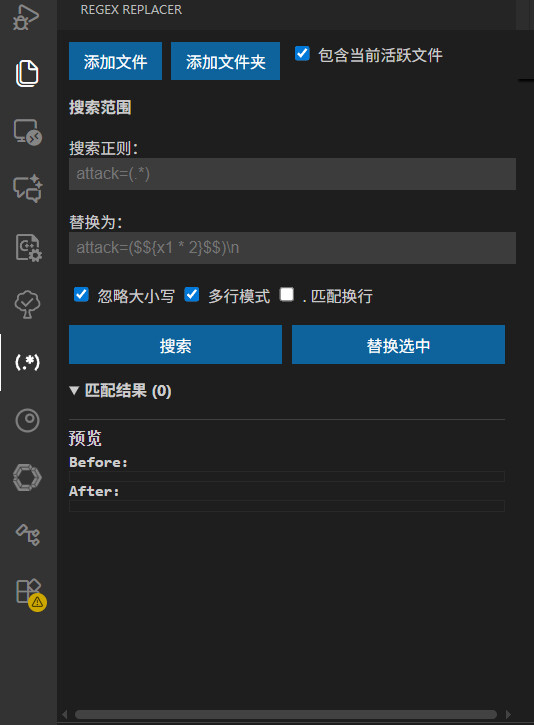

# Regex Replacer

A VSCode extension for advanced regex search and programmable replacement in files or folders. It provides a dedicated sidebar panel for managing search scopes, viewing matches with previews, and selectively replacing content. Supports multiline searches, JS-eval in replacements, and more.

**中文描述：**  
VSCode 扩展，用于文件或文件夹中的高级正则搜索和可编程替换。提供专用侧边栏面板，用于管理搜索范围、查看匹配项预览，并选择性替换内容。支持多行搜索、替换中的 JS 表达式等。

## Features (功能)

- **Intuitive Sidebar Panel**: All operations in a clean, native VSCode-style interface.
  - Add files/folders to search scope.
  - Include active file dynamically.
  - Regex input with flags (ignore case, multiline, dotall).
  - Replacement template with programmable JS (e.g., `$${x1 * 2}$$` where `x1` is the first capture group).
- **Match List**: Scrollable list of matches with checkboxes for selection, previews (original → replaced), and click-to-jump to file location.
- **Preview Window**: Detailed before/after multiline previews for selected matches.
- **Multiline Support**: Use `\n` in regex/replace; multiline mode translates `\n` to actual newlines.
- **Relative Paths**: Displays paths relative to workspace for better readability.
- **Right-Click Integration**: Add files/folders from Explorer context menu.

**示例：**  
- Search: `attack=(.*)`  
- Replace: `attack=($${x1 * 2}$$)\\n` (multiplies value by 2 and adds a newline if multiline mode is on).  
- Flags: Global, ignore case, multiline enabled by default.

## Installation (安装)

1. Open VSCode.
2. Go to Extensions view (Ctrl+Shift+X).
3. Search for "Regex Replacer".
4. Install and reload VSCode.

Alternatively, download the `.vsix` from releases and install via "Install from VSIX...".

## Usage (使用指南)

1. Open the sidebar: Click the "Regex Replacer" icon in the activity bar.
2. **Set Search Scope**:
   - Click "Add File" or "Add Folder" to include targets.
   - Check "Include Current Active File" (default: on) to always search the open editor.
   - Toggle checkboxes to enable/disable scopes.
3. **Enter Regex and Replace**:
   - Search Regex: e.g., `attack=(.*)` (supports `\n` for multiline).
   - Replace: e.g., `attack=($${x1 * 2}$$)\\n` (JS eval inside `$${...}$$`).
   - Flags: Ignore Case (default), Multiline (default), Dot Matches Newline.
4. **Search and Replace**:
   - Click "Search" to list matches.
   - Select matches via checkboxes.
   - Preview selected match in the bottom panel.
   - Click "Replace Selected" to apply changes.
5. **Jump to Match**: Click a match in the list to open the file at the exact location.

**Screenshot (截图):**  
  

---

Developed by [Your Name]. Feedback: [your-email@example.com].
